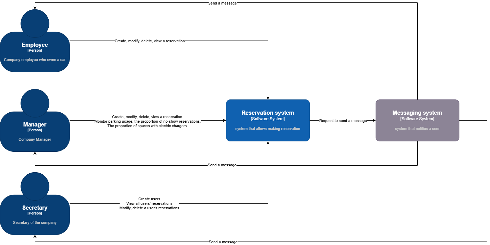
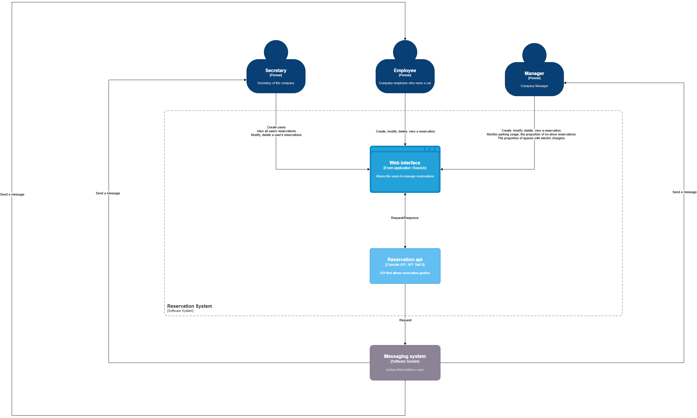

# SpaghettiCoderZ :

## **Repository** :

[https://github.com/Silverliee/SpaghettiCoderZ](https://github.com/Silverliee/SpaghettiCoderZ)

## Business Need

Reserve and manage our parking spaces

## Context

### User

A user is defined by:

- First Name
- Last Name
- Role (Employee, Secretary, Manager)
- Contact

### Parking Space

A parking space is defined by:

- Identifier
- Electric charger (yes/no)

## Constraints

A reservation can be made for a maximum of 5 business days (cannot reserve a space for the entire month) and can start the same day if space is available.

- If someone needs to charge, they must request a space in rows A or F with electrical outlets.
- An employee must check-in when parking their car to confirm that the space has been occupied as planned.
- A QR code with the space number pointing to a dedicated endpoint in your application will be printed at each parking space.
- If a reserved space does not receive check-in confirmation before 11 AM, it is marked as available and can be reserved by someone else the same day.
- Employees must be completely autonomous in making their reservations with this application, but secretaries will always be responsible for support and need full administrator access to the back-office of your application to manually modify anything necessary.
- Your application must not only have current and future reservations, but must also keep track of the complete reservation history.
- In addition to the Employee profile (what an employee sees when opening the application) and the Secretary profile (see everything with editing capabilities, including adding new users and managing them), there should also be a Management profile: Managers need to see a dashboard to know how many people use the parking, how full it is on average, what is the proportion of people who make a reservation but don't use it, and the proportion of spaces with electric chargers.
- Managers could also reserve their parking through the application, but they are allowed to reserve the space for a full month duration (30 days).
- When someone makes a reservation, a message to a queue must be sent to be processed by another application that will send a confirmation email.

## Solution

An internal web application

## Why

Fast to develop (time constraint), accessible via all devices especially phone, expertise of the 4 group members

## Scope

- View reservations
- Create, modify, or cancel a reservation
- Get statistics on reservations
- Notify users

 

## C4 driagram :

### Context :

### Container :

## Architecture Decision Records :

[ADR-001: User and Parking Spot Entity Modeling](Docs/ADR-001%20User%20and%20Parking%20Spot%20Entity%20Modeling.md)

[ADR-002: Technical stack choice for front-end user interface](Docs/ADR-002%20Technical%20stack%20choice%20for%20front-end%20user.md)

[ADR-003: Technical stack choice for reservation API](Docs/ADR-003%20Technical%20stack%20choice%20for%20reservation%20API.md)